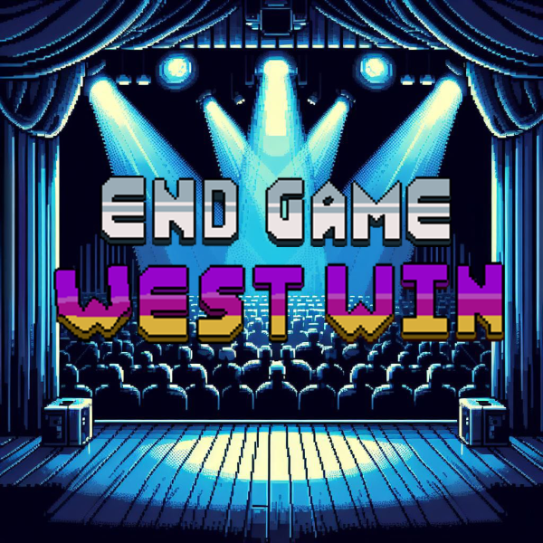
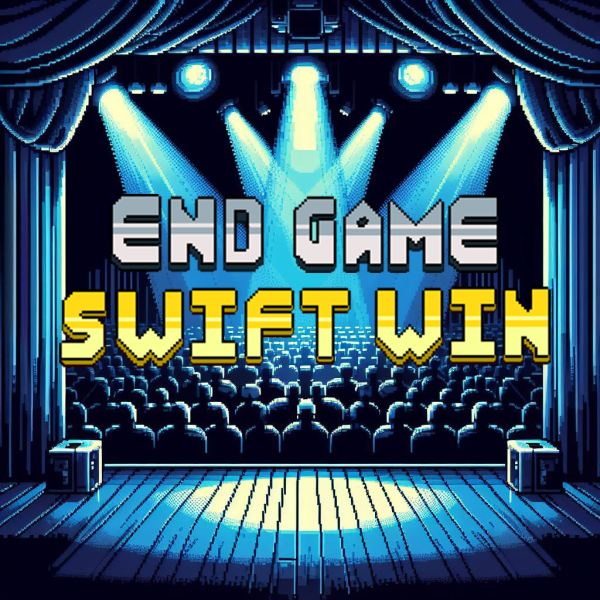

<div style="background-color: rgba(240, 240, 240, 0.8); padding: 20px;">

# Swift Of Fightwest 🎤🥋
### Nosso time 🚀 <br>
[Luiza Trigueiro-(ltrb)](https://github.com/luizatrigueiro) <br>

[Maria Clara Gomes-(mcga)](https://github.com/M4riaclaragomes) <br>

[Beatriz dos Anjos-(bma3)](https://github.com/Beatriz-dos-Anjos) <br>

[Antonio Rodrigues-(arpc3)](https://github.com/AntonioCar0lin0) <br>

[Paulo Vieira-(pegv)](https://github.com/paulogestosa) <br>

[Sérgio Lira-(sll)](https://github.com/SergioL1ra) <br>

---

# Conhecendo nosso Jogo:


**Swift of Fightwest** é um jogo de luta em que você terá a ilustre opção de jogar com uma ícone do mundo POP ou um….bem, vamos pular esse quesito. Você poderá escolher  jogar em arenas mundialmente famosas, como o **palco do vma** e entre outras futuramente lançadas. O funcionamento do jogo é simples, temos todos os comandos que podem ser realizados em jogos de lutas tradicionais, andar, pular, socar, chutar e um ataque especial.<br>
Assim, nosso principal objetivo foi fazer uma luta entre os personagens de Taylor Swift e Kanye West com os golpes diminuindo a barra da vida. Enquanto isso, os troféus  (Grammy e Vma) começam a cair, juntamente com  o Jordan , e ao conseguir capturá-los,  esse contribui para diminuir a vida, enquanto que aqueles, para recuperá-la. 
Preparado para se divertir?
### Personagens:
Nosso jogo é multiplayer local, ou seja, você e seu amigo podem travar essa luta épica lado a lado até a morte.<br>
Para essa aventura você podera escolher entre dois personagens

De um lado você pode escolher a diva pop super influente na atualidade, **Taylor Swift**   

Do outro, bom... só o **Kanye West** mesmo 

### Como jogar:
Nosso jogo é multiplayer local, então você e seu amigo podem jogar juntos lado a lado.<br>
A primeira coisa a decidir é quem será a Taylor e quem será o Kanye.<br>
#### Movimentação da Taylor
Para controlar a Taylor iremos usar as **Flechas** do teclado, alem disso a taylor tabem dá socos no **“B”** e chutes no **“N”**
#### Movimentação do Kanye
Para controlar o Kanye, iremos usar as teclas **W, A, D**. Além disso, o Kanye também dá socos no **E**, chuta no **R** e consegue se defender no **F**.
#### Coletáveis
Além da luta, o jogo também contará com alguns elementos que cairão do "céu" e poderão ser coletados. Os elementos são o troféu do **VMA**, do **Grammy** e um tênis **Jordan**; este último diminuirá a vida do personagem que o pegar, enquanto os outros dois aumentarão.

---
## Estrutura de Pastas:

### Arquitetura de pastas do projeto

### scr

O diretório **"src"** é onde está contido o **código-fonte** principal do projeto. Todos os arquivos e diretórios relacionados à implementação do software são agrupados aqui.
Dentro do "src" temos vários subdiretórios que agrupam os principais códigos do programa:
O subdiretório "**objetos_interagiveis"** contém as classes referentes aos objetos coletáveis: 'Grammy', 'Vma' e 'Jordan', divididas em 3 arquivos diferentes.
O subdiretório **"personagens"** contém todo o script de cada um dos dois personagens, contendo também o arquivo que coloca as spritesheets dentro do jogo.
O subdiretório **"telas"** contém as configurações das diferentes telas que mostramos na execução do jogo.
O subdiretório **"utilities"** contém arquivos que possuem funções que estão sendo usadas em vários scripts do jogo e também contém um arquivo com a classe referente as barras de vida dos personagens.

```text
scr/
├── objetos_interagiveis
├── personagens
├── telas
├── utilities
├── main.py
```

### assets

Arquivos de assets do jogo. Imagens, sons, etc.

```text
assets/

├── images
├── background
├── backgrounds
```

## Como Baixar:
>+ Basta Ter o Python e o Pygame instalados em sua Máquina.<br>

>+ Clonar este repositório .<br>

>+ Rodar o arquivo main.py.<br>

## Divisão de tarefas do projeto:

| Nome                  | Contribuições                                                                                   |
|-----------------------|------------------------------------------------------------------------------------------------|
| Antonio Carolino      | Movimentação dos personagens,Implementação das Sprites da Taylor                                       |
| Beatriz Dos Anjos     |  Movimentação dos objetos caindo, Colisão objetos caindo e personagens, Sprites da Taylor                |
| Luiza Trigueiro       | Orientação dos objetos, README, parte visual e técnica da arena, colisão de objetos e personagens caindo |
| Maria Clara Gomes     | README, slides, parte visual e técnica da arena                    |
| Paulo Vieira          | Movimentação dos personagens,Sprites do Kanye, Implementação das Sprites do Kanye                                                                                                |
| Sérgio Lira           | Tela de Menu, Logo do jogo                                                                                                |

## Conceitos utilizados:
### Os **conceitos** que foram apresentados durante a disciplina e utilizados no projeto:<br>
**🔄Estruturas de Repetição:** O jogo em si é construído dentro de um loop, no qual ou se a pessoa escolher sair ou perder, é finalizado. Logo, todas as ações estão dentro dele (objetos caindo, personagens se movimentando, exibição de telas). O loop foi utilizado internamente para formar as listas com as sprites do logo e movimentação dos personagens.<br>

**🛠️Funções:** Fizemos diversas funções/métodos para ajudar na otimização do código, como para marcar as colisões entre os personagens, bem como as deles e dos objetos coletáveis caindo ; os comandos de ataque para o personagem ; estabelecer a movimentação, só que de ambos os personagens; perder e ganhar vida  baseado nos danos ou recuperações; atualizar a barra que delimite  a utilização do ataque especial; além do innit, o qual cria o objeto de cada classe; também usamos na **animação das sprites.** 

**⚖️Condicionais:** as condicionais são amplamente utilizadas em diversas partes do jogo para controlar e delimitar diferentes aspectos do seu funcionamento:<br>
**1-** Delimitação de Ações do Personagem: Condicionais são usadas para controlar o momento em que certas ações podem ser executadas, como permitir que um ataque seja realizado apenas após um certo período de tempo ou verificar se ainda há vida nos personagens.<br>
**2** -Atualização de Elementos Gráficos: São aplicadas para atualizar a visualização de elementos gráficos, como as barras de vida dos personagens, garantindo que sejam exibidas corretamente e de acordo com a situação.<br>
**3-** Gestão de Colisões: As condicionais são fundamentais para verificar e lidar com colisões entre objetos no jogo, aplicando as ações corretas quando ocorrem interações entre eles.<br>
**4-** Controle de Movimentação: São utilizadas para controlar a movimentação dos personagens com base nas entradas do jogador, garantindo que se movam de acordo com as teclas pressionadas e permaneçam dentro dos limites da tela.<br>
**5-** Configuração de Animações: Condicionais determinam quais animações devem ser exibidas com base nas diferentes situações do jogo, como movimento ou ataque, e permitem a transição suave entre elas.

**🏛️Herança:** a situação em que uma classe pode utilizar atributos e métodos de outra classe é recorrente nas colisões. Na parte dos personagens, por exemplo, usou a definição de quem seria o jogador ( na classe da Taylor e do Kanye) na classe barra de vida; as classes do grammy, vma e jordan utilizam também o retângulo formado por cada personagem ( que está na sua  respectiva classe) para caracterizar a colisão. 

**📜Listas:** para fazer a animação da logo aparecer, cada um dos frames foram guardados em listas (pegando sempre o primeiro elemento e gradualmente mudando) - a mesma coisa foi feita para o botão start; a animação dos personagens também foi feita por lista num loop para adicionar cada frame (com quantidade previamente estabelecida no código), além da imagem ter sido redimensionada. Entretanto, vale ressaltar que para eles houve uma fragmentação no código, pois um continha o loop formador da lista e o outro direcionava de qual arquivo do computador deveria extrair as sprites - segundo a movimentação desejada. 

---
## Ferramentas e Frameworks
Para estruturar o código utilizamos a ferramenta **VSCode**, já a ferramenta de depuração usamos para debugar os códigos e o **Github** a fim de armazenar todas as versões dos programas feitos.<br>
As bibliotecas utilizadas foram o **Pygame**, que facilita o desenvolvimento dos jogos ao otimizar o código nas ações de detecção de colisão, desenho de formas geométricas, detecção da quantidade de frames e duração do jogo, bem como o controle da aparição e desaparecimento das telas.
## Desafios e Erros:
Os principais **desafios** foram a escolha das sprites, aprender a usar o GitHub de forma completa, organizar as tarefas efetivamente e gerir o tempo com os outros projetos atribuídos<br>
Os nossos **erros** foram: Tentar criar as sprites do zero durante boa parte do processo, afetando o nosso tempo nas partes finais e mais complicadas do projeto. outro erro foi não ter dado prioridade suficiente para a parte dos objetos coletáveis. 
## Lições aprendidas 
### As lições aprendidas com os desafios e erros enfrentados durante o projeto incluem:<br>
**Planejamento Adequado:** É crucial dedicar tempo suficiente ao planejamento antes de iniciar qualquer projeto. Isso inclui definir claramente os requisitos, priorizar tarefas e estimar o tempo necessário para cada etapa<br>
**Uso Eficiente de Recursos:** Tentar criar recursos complexos, como sprites, do zero pode consumir tempo valioso. É importante avaliar se é mais eficiente usar recursos pré-existentes ou buscar ajuda externa quando necessário<br>
**Gerenciamento de Tempo:** Gerenciar o tempo de forma eficaz é essencial, especialmente quando se tem múltiplos projetos em andamento. Estabelecer prazos realistas e dividir as tarefas em etapas menores pode ajudar a evitar a sobrecarga e garantir que todas as áreas do projeto recebam a atenção necessária.

---

# 🖼️Galeria do jogo
#### ▶️Tela inicial

#### 👤Seleção de personagem

#### 📸 Telas Finais




# [Vem ver nossa apresentação!](https://www.canva.com/design/DAF_sR2AzFc/-Tim_JI4ib-LocTNZ-nzWg/edit?utm_content=DAF_sR2AzFc&utm_campaign=designshare&utm_medium=link2&utm_source=sharebutton) 
